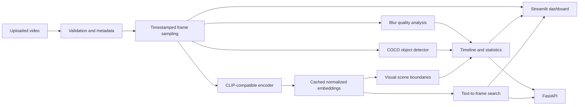

# SurgiVision AI

SurgiVision AI is a research-oriented computer-vision application for exploring laparoscopic and endoscopic procedure videos. It combines efficient video sampling, deterministic image-quality measurements, general-purpose pretrained vision models, scene segmentation, and timestamped visual search behind Streamlit and FastAPI interfaces.

## Overview

Surgical video is a demanding computer-vision domain: procedures are long, visual appearance changes quickly, instruments occlude anatomy, and image quality varies with motion, focus, lighting, and fluids. SurgiVision AI provides a modular engineering baseline for ingesting these videos and inspecting model outputs without implying clinical validity.

The default detector is a COCO-pretrained Faster R-CNN model from Torchvision. It reports general object classes and separately surfaces COCO labels such as `knife` or `scissors` as instrument-like events. It is not a surgical-instrument-specific model. Visual embeddings and text-to-frame retrieval use a general LAION-pretrained CLIP-compatible model through OpenCLIP.

## Features

- Validated video ingestion with FPS, frame count, duration, codec, and resolution metadata
- Configurable interval sampling with exact source-frame timestamps
- Explainable blur scoring based on variance of the Laplacian
- Batched COCO-pretrained object detection with bounding boxes and confidence scores
- Normalized visual embeddings cached for the lifetime of an analysis session
- Text-to-frame retrieval using cosine similarity in a shared image/text embedding space
- Visual scene-boundary detection based on adjacent-frame embedding distance
- Timestamped quality, detection, scene, and instrument-like-label timelines
- Derived statistics for sampling, quality, detections, scenes, runtime, and inference device
- Interactive Streamlit dashboard and documented FastAPI service
- Synthetic demo-video generator, automated tests, Docker image, and GitHub Actions workflow
- Automatic CUDA, Apple Silicon MPS, or CPU device selection

## Architecture



Pretrained models are initialized lazily and reused by each application process. Their weights are downloaded by the supporting libraries on first use and are not stored in this repository.

The configured detector is documented in the [Torchvision Faster R-CNN reference](https://docs.pytorch.org/vision/stable/models/generated/torchvision.models.detection.fasterrcnn_resnet50_fpn_v2.html). The configured embedding checkpoint and its MIT license metadata are available in the [LAION model card](https://huggingface.co/laion/CLIP-ViT-B-32-laion2B-s34B-b79K).

## Tech Stack

- Python 3.11+
- PyTorch and Torchvision
- OpenCLIP
- OpenCV, NumPy, pandas, and Pillow
- FastAPI and Pydantic
- Streamlit and Plotly
- pytest, Docker, and GitHub Actions

## Installation

Create an isolated Python 3.11 or newer environment:

```bash
python3.11 -m venv .venv
source .venv/bin/activate
python -m pip install --upgrade pip
python -m pip install -e ".[dev]"
```

Model weights are fetched on the first full analysis. A CPU is sufficient; CUDA or Apple MPS is selected automatically when available.

## Quick Start

Create a small synthetic video for software testing:

```bash
python scripts/create_demo_video.py --output data/demo.mp4
```

Launch the dashboard:

```bash
streamlit run app/dashboard.py
```

Launch the API in a separate terminal:

```bash
uvicorn app.api:app --host 0.0.0.0 --port 8000
```

Run the test suite without downloading model weights:

```bash
pytest
```

## Usage

In the dashboard, upload an MP4, MOV, AVI, MKV, or WebM file, select a sampling interval, and start analysis. Larger intervals reduce model work at the cost of temporal detail. The resulting tabs show video-level statistics, blur measurements, timestamped events, annotated sampled frames, and semantic search results.

Search queries describe visible content, for example `instrument visible`, `close-up scene`, or `dark frame`. Similarity scores are relative ranking signals from a general vision-language model, not clinical probabilities.

The demo video contains labeled synthetic shapes and scene changes. It is intended only to test the software path and does not resemble or represent surgical footage.

## API

Interactive API documentation is available at `http://localhost:8000/docs` while the service is running.

| Method | Path | Purpose |
| --- | --- | --- |
| `GET` | `/health` | Service version and liveness |
| `POST` | `/analyze` | Upload and synchronously analyze a video |
| `GET` | `/analysis/{analysis_id}` | Retrieve serializable metadata, frames, events, and statistics |
| `POST` | `/search` | Search cached frame embeddings by text |

Example analysis request:

```bash
curl -X POST "http://localhost:8000/analyze?sampling_interval_s=2" \
  -F "video=@data/demo.mp4"
```

Example search request using the returned analysis identifier:

```bash
curl -X POST http://localhost:8000/search \
  -H "Content-Type: application/json" \
  -d '{"analysis_id":"<analysis-id>","query":"dark frame","top_k":5}'
```

Analysis sessions are held in a bounded, process-local memory cache. They expire on server restart or least-recently-used eviction. The API does not provide durable storage or distributed job processing.

## How It Works

### Frame sampling

The loader validates the file and reads stream metadata with OpenCV. The sampler converts a requested interval into a frame step using the measured FPS, seeks to each source-frame index, and records timestamps as `frame_index / FPS`. A configurable cap prevents unexpectedly large inference workloads.

### Quality analysis

Each sampled frame is converted to grayscale and scored using the variance of its Laplacian response. Values below the configured threshold are marked as unusually blurry. The score is a technical image-quality heuristic only.

### Detection

The detector batches RGB tensors and runs Torchvision Faster R-CNN under inference mode. Results above the confidence threshold retain the source timestamp, COCO class, confidence, and bounding box. The detector abstraction can be replaced by a validated domain-specific checkpoint without changing the rest of the pipeline.

### Embeddings and search

OpenCLIP encodes sampled frames and queries into the same normalized feature space. Frame embeddings are computed once per session. Search L2-normalizes both sides, computes cosine similarity with a matrix-vector product, and returns the highest-ranked timestamps and frames.

### Scene segmentation and timeline

Adjacent sampled-frame embeddings are compared by cosine distance. Distances above the configured threshold create visual scene boundaries. These are appearance changes, not inferred surgical phases. The timeline merges observed samples, blur flags, object detections, instrument-like COCO labels, and scene boundaries in timestamp order.

## Configuration

Configuration is read from environment variables when an application process starts.

| Variable | Default | Meaning |
| --- | ---: | --- |
| `SURGIVISION_SAMPLING_INTERVAL` | `2.0` | Seconds between sampled frames |
| `SURGIVISION_MAX_FRAMES` | `300` | Maximum sampled frames per analysis |
| `SURGIVISION_BLUR_THRESHOLD` | `80.0` | Minimum variance-of-Laplacian score |
| `SURGIVISION_DETECTION_CONFIDENCE` | `0.50` | Minimum detector confidence |
| `SURGIVISION_DETECTION_BATCH_SIZE` | `4` | Object-detector batch size |
| `SURGIVISION_EMBEDDING_BATCH_SIZE` | `16` | Embedding batch size |
| `SURGIVISION_SCENE_DISTANCE` | `0.18` | Adjacent embedding-distance boundary threshold |
| `SURGIVISION_MAX_UPLOAD_MB` | `500` | Upload-size limit |
| `SURGIVISION_SEARCH_RESULTS` | `6` | Default semantic-search result count |
| `SURGIVISION_CLIP_MODEL` | `ViT-B-32` | OpenCLIP architecture |
| `SURGIVISION_CLIP_PRETRAINED` | `laion2b_s34b_b79k` | OpenCLIP pretrained-weight tag |

## Docker

Build and run the CPU-compatible dashboard image:

```bash
docker build -t surgivision-ai .
docker run --rm -p 8501:8501 surgivision-ai
```

Run the API from the same image:

```bash
docker run --rm -p 8000:8000 surgivision-ai \
  uvicorn app.api:app --host 0.0.0.0 --port 8000
```

The container downloads model weights on first full analysis. Mount the configured model cache directory if downloads should persist across containers.

## Project Structure

```text
.
├── app/
│   ├── api.py
│   └── dashboard.py
├── scripts/
│   └── create_demo_video.py
├── src/surgivision/
│   ├── analysis/
│   │   ├── search.py
│   │   ├── statistics.py
│   │   ├── store.py
│   │   └── timeline.py
│   ├── models/
│   │   ├── feature_encoder.py
│   │   └── instrument_detector.py
│   ├── video/
│   │   ├── loader.py
│   │   ├── quality.py
│   │   └── sampler.py
│   ├── config.py
│   ├── exceptions.py
│   ├── pipeline.py
│   └── types.py
├── tests/
├── Dockerfile
├── pyproject.toml
└── README.md
```

## Limitations

- The general-purpose detector was not trained to provide comprehensive or reliable surgical-instrument labels and may miss, confuse, or incorrectly localize objects in surgical footage.
- The general CLIP-compatible encoder is not medically validated. Text retrieval and visual scene boundaries require domain-specific evaluation before research conclusions are drawn.
- Scene segmentation measures sampled-frame appearance changes; it does not recognize surgical phases or procedural intent.
- Monocular, frame-level observations lack temporal, patient, procedural, and clinical context.
- Results depend on video encoding, image quality, sampling interval, thresholds, hardware, and model checkpoint.
- Synchronous API analysis and process-local storage are intended for demonstrations and research workflows, not production-scale processing.

## Safety / Medical Disclaimer

SurgiVision AI is a research and educational software project. It is not a medical device, has not been clinically validated, and must not be used for diagnosis, treatment, surgical guidance, or other patient-care decisions.

## Future Work

- Integrate independently validated surgical-instrument-specific checkpoints
- Add evaluated temporal models for surgical phase recognition
- Support multimodal video, audio, and structured procedure context
- Add persistent job storage and optimized real-time inference
- Evaluate calibrated scene thresholds on appropriately governed domain datasets

## License

This project is licensed under the [MIT License](LICENSE). Pretrained model weights are downloaded separately at runtime and remain subject to their respective upstream terms.
